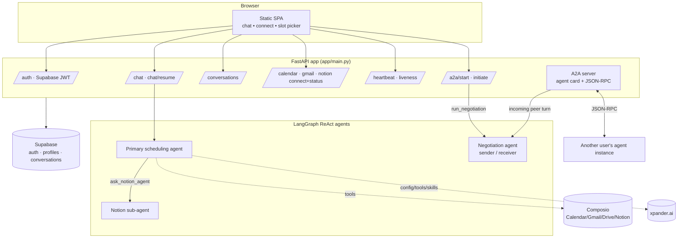
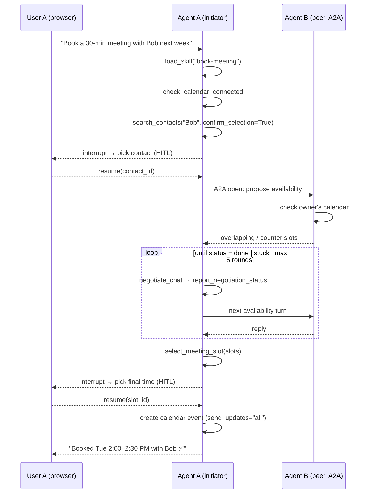

# Meeting Scheduler — Multi-Agent Assistant with Agent-to-Agent Negotiation

A FastAPI backend powering a personal meeting-scheduling assistant. Each user runs
their own agent instance that can chat, manage Google Calendar / Gmail / Notion, and
— most notably — **negotiate meeting times directly with another user's agent over
the [A2A (Agent-to-Agent) protocol](https://github.com/a2aproject)**.

The agent is built on **[LangGraph](https://langchain-ai.github.io/langgraph/)**
(ReAct), pulls its configuration, tools, and skills from the
**[xpander.ai](https://xpander.ai) platform**, integrates third-party apps through
**[Composio](https://composio.dev)**, and persists auth + conversations in
**[Supabase](https://supabase.com)**.

---

## Highlights

- **Agent-to-Agent negotiation** — Two independent agent instances exchange calendar
  availability over JSON-RPC until they converge on mutually workable slots. Each
  agent only ever sees its *own* owner's calendar; availability is shared as text.
- **Multi-agent orchestration** — A primary scheduling agent delegates Notion work to
  a dedicated Notion sub-agent via an `ask_notion_agent` tool.
- **Human-in-the-loop (HITL)** — LangGraph `interrupt`s pause the graph so the user can
  pick a contact or confirm a meeting slot in the UI, then `resume` the run.
- **Skill playbooks** — Markdown `SKILL.md` files (merged with platform skills from
  xpander) provide step-by-step workflows the agent loads on demand via `load_skill`.
- **xpander.ai integration** — Model, system instructions, tools, and skills are fetched
  at runtime from an xpander agent definition.
- **Composio-powered integrations** — Google Calendar, Gmail, Google Drive, and Notion,
  each with an OAuth connect flow and live connection-status checks.

---

## Architecture



Every instance is **symmetric**: it always *serves* the A2A routes (so any peer can
reach it) and can *initiate* a negotiation against any peer URL handed to it at call
time. Roles (sender/receiver) are decided per conversation, never per process.

---

## How meeting negotiation works



The negotiation agent reports a status each turn via the `report_negotiation_status`
tool:

| Status            | Meaning                                                        |
| ----------------- | -------------------------------------------------------------- |
| `done`            | All mutually workable times listed; owners choose in the UI.   |
| `needs_more_slots`| Send the reply to the peer for another round.                  |
| `stuck`           | No progress possible (no overlap / peer unresponsive).         |

A heartbeat (every ~60s) keeps each agent's `agent_url`, `last_seen_at`, and
calendar-connected flag fresh in Supabase. Contacts are only **selectable** for
negotiation when their agent has been seen within the TTL (180s) and has Calendar
connected.

---

## Tech stack

| Layer        | Technology                                                       |
| ------------ | ---------------------------------------------------------------- |
| API          | FastAPI · Uvicorn                                                 |
| Agents       | LangGraph (ReAct) · LangChain · `langchain-openai`               |
| Agent config | xpander.ai SDK (`xpander-sdk`)                                    |
| Integrations | Composio (Google Calendar, Gmail, Google Drive, Notion)          |
| A2A          | `a2a-sdk` 1.1.0 (protobuf / JSON-RPC)                             |
| Data / Auth  | Supabase (Postgres + Auth)                                       |
| LLM          | OpenAI (model name resolved from the xpander agent)              |
| Frontend     | Static HTML/CSS/JS SPA served by FastAPI                         |

---

## Project structure

```
agents/
├── app/
│   ├── main.py                 # FastAPI app, router wiring, A2A + static mounts
│   ├── a2a.py                  # A2A serve (card + JSON-RPC) and initiate logic
│   ├── deps.py                 # Supabase JWT bearer auth dependency
│   ├── database.py             # Supabase client
│   ├── conversation_store.py   # Conversation persistence helpers
│   ├── instance_owner.py       # Maps this running instance to its Supabase user
│   ├── routers/
│   │   ├── auth.py             # login / signup / me / logout
│   │   ├── chat.py             # /chat and /chat/resume (HITL)
│   │   ├── conversations.py    # list / fetch stored conversations
│   │   ├── calendar.py         # Google Calendar connect / status
│   │   ├── gmail.py            # Gmail connect / status
│   │   ├── notion.py           # Notion connect / status
│   │   ├── a2a_negotiate.py    # /api/a2a/start — initiate a negotiation
│   │   ├── heartbeat.py        # liveness + owner registration
│   │   └── health.py           # /health
│   ├── static/                 # SPA (index.html, login, signup, auth.js/css)
│   └── assets/                 # Integration logos
├── langchain_agents/
│   ├── agent_u.py              # Primary + negotiation agent bundles, chat loop
│   ├── notion_agent.py         # Dedicated Notion sub-agent
│   └── tools/                  # check_*, search_contacts, select_meeting_slot,
│                               #   ask_notion_agent, skills, negotiation_status
├── prompts/                    # System prompts (agent_u, notion_agent, negotiation)
├── skills/                     # SKILL.md playbooks (book-meeting, meeting-negotiation)
├── scripts/add_drive.py        # Attach Google Drive tools to the xpander agent
├── DATABASE_SCHEMA.md          # Supabase table definitions
└── requirements.txt
```

---

## Setup

### 1. Prerequisites

- Python 3.11+
- A [Supabase](https://supabase.com) project
- API keys for [OpenAI](https://platform.openai.com), [xpander.ai](https://xpander.ai),
  and [Composio](https://composio.dev)

### 2. Install

```bash
python3 -m venv .venv
source .venv/bin/activate
pip install -r requirements.txt
```

### 3. Configure the database

Run the SQL in [`DATABASE_SCHEMA.md`](./DATABASE_SCHEMA.md) against your Supabase
project to create the `agent_profiles` and `conversations` tables.

### 4. Environment variables

Create a `.env` file in the `agents/` directory:

```bash
# LLM
OPENAI_API_KEY=sk-...

# xpander.ai — agent definition (model, instructions, tools, skills)
XPANDER_API_KEY=...
XPANDER_ORGANIZATION_ID=...
XPANDER_AGENT_ID=...

# Composio — third-party integrations
COMPOSIO_API_KEY=...

# Supabase — auth + persistence
SUPABASE_URL=https://<project>.supabase.co
SUPABASE_ANON_KEY=...

# A2A — how this instance advertises itself to peers
A2A_BASE_URL=http://localhost:8001
A2A_AGENT_NAME=Agent A

# Optional
NOTION_AGENT_MODEL=gpt-4o
```

> `.env` is gitignored. Never commit real keys. Note that the schema stores OAuth
> tokens; treat your Supabase project and keys as secrets.

### 5. Run

```bash
uvicorn app.main:app --reload --port 8001
```

- App / SPA: http://127.0.0.1:8001/
- Interactive API docs: http://127.0.0.1:8001/docs
- Health check: http://127.0.0.1:8001/health
- A2A agent card: http://127.0.0.1:8001/.well-known/agent-card.json

### 6. Try A2A locally (two instances)

Run two instances on different ports, each pointed at its own `A2A_BASE_URL`, then
sign in to each in the browser so heartbeat registers both owners. From one user's
chat, ask to book a meeting with the other registered user.

```bash
# Terminal 1
A2A_BASE_URL=http://localhost:8001 A2A_AGENT_NAME="Agent A" uvicorn app.main:app --port 8001

# Terminal 2
A2A_BASE_URL=http://localhost:8002 A2A_AGENT_NAME="Agent B" uvicorn app.main:app --port 8002
```

---

## API overview

All `/api/*` routes (except auth login/signup) require a Supabase JWT as a
`Authorization: Bearer <token>` header.

| Method | Path                       | Description                                   |
| ------ | -------------------------- | --------------------------------------------- |
| POST   | `/api/auth/signup`         | Create an account                             |
| POST   | `/api/auth/login`          | Sign in, returns access/refresh tokens        |
| GET    | `/api/auth/me`             | Current user                                  |
| POST   | `/api/chat`                | Run one agent turn (may return an interrupt)  |
| POST   | `/api/chat/resume`         | Resume after a HITL interrupt                 |
| GET    | `/api/conversations`       | List the user's conversations                 |
| GET    | `/api/conversations/{id}`  | Fetch a conversation's messages               |
| POST   | `/api/calendar/connect`    | Start Google Calendar OAuth                   |
| GET    | `/api/calendar/status`     | Calendar connection status                    |
| POST   | `/api/gmail/connect`       | Start Gmail OAuth                             |
| GET    | `/api/gmail/status`        | Gmail connection status                       |
| POST   | `/api/notion/connect`      | Start Notion OAuth                           |
| GET    | `/api/notion/status`       | Notion connection status                      |
| POST   | `/api/heartbeat`           | Register/refresh this agent's liveness        |
| POST   | `/api/a2a/start`           | Initiate a negotiation against a peer URL     |
| —      | A2A agent card + JSON-RPC  | Served for peer discovery and messaging       |

---

## Key design notes

- **Sync endpoints on purpose.** `/chat` is defined as a sync `def` so FastAPI runs the
  blocking LLM/Composio calls in a threadpool rather than on the event loop.
- **Agent work runs off the request loop.** The xpander SDK bridges async→sync by
  driving the running loop; A2A turns are dispatched to a dedicated
  `ThreadPoolExecutor` so they never corrupt the server's event loop.
- **Per-user agent caching.** Agent bundles are cached per `user_id` with an in-process
  `InMemorySaver` checkpointer, so multi-turn context is preserved per conversation
  thread.
- **Calendar is never exposed over A2A.** It stays a private tool inside each agent;
  peers only ever exchange availability as text.

---

## Skills

Skills are markdown playbooks under `skills/`, each with YAML frontmatter
(`name`, `description`) and a step-by-step body. The agent sees a catalog in its system
prompt and loads the full body on demand with `load_skill`. Platform skills from the
xpander agent are merged into the same catalog.

- **`book-meeting`** — End-to-end booking flow (connection check → contact selection →
  A2A negotiation → slot selection → calendar event).
- **`meeting-negotiation`** — The response format and turn-by-turn rules an agent
  follows while negotiating availability with a peer.
